# Print Management System

Print Management System is a university-focused web application being built as an in-house replacement for PaperCut. The project targets pull printing, quota control, printer and queue management, auditability, admin visibility, and technician error handling.

The current codebase is now a full-stack MVP foundation, not only a frontend prototype. It includes a React frontend, a TypeScript/Express backend, PostgreSQL migrations, DB-backed authentication for development, job submission/history, admin management flows, technician flows, logs, queues, groups, printers, and diagnostic printer delivery paths.

## Screenshots

### Application Interface

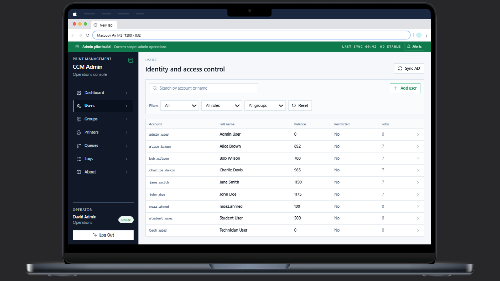
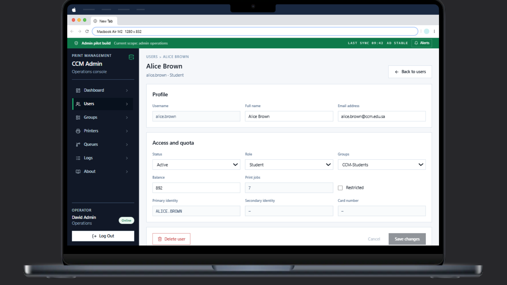
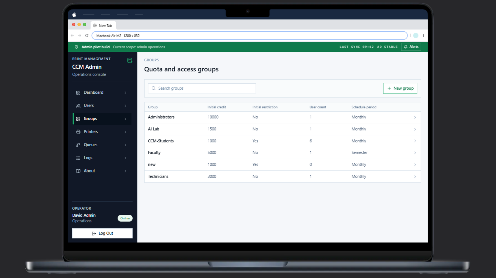
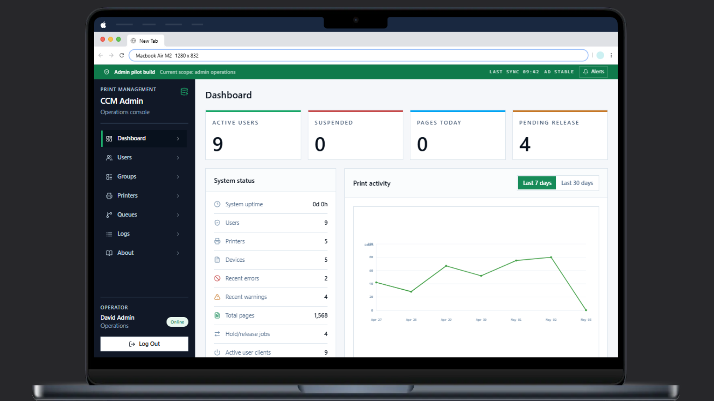
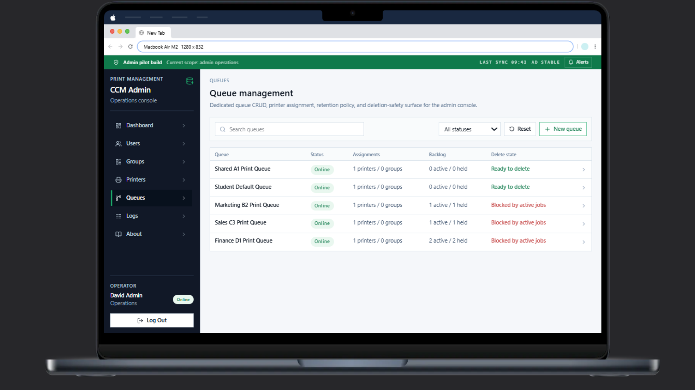
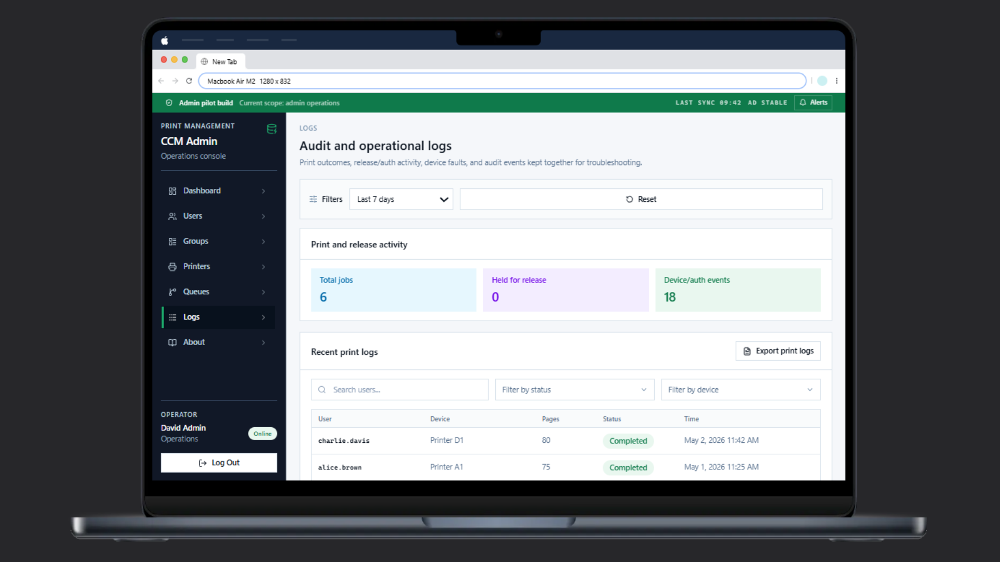
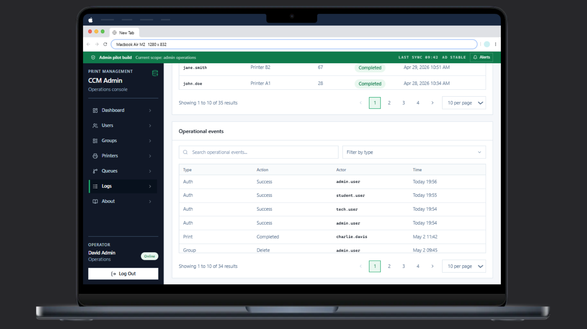
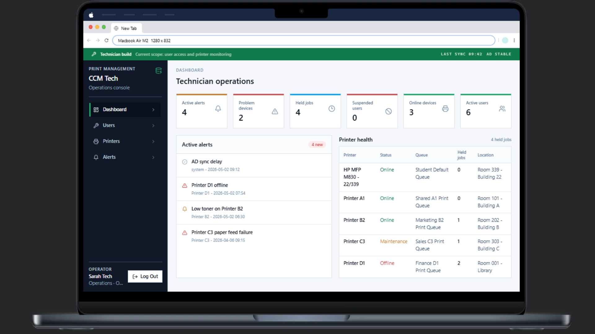
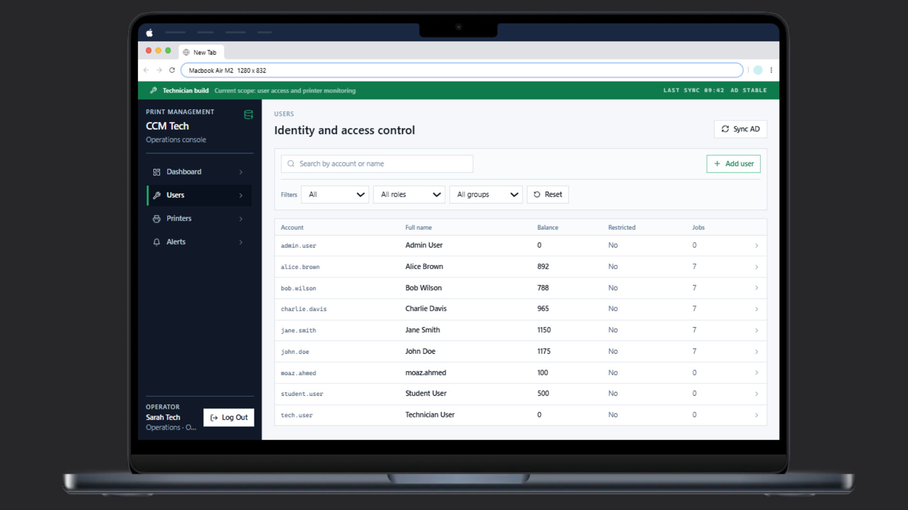
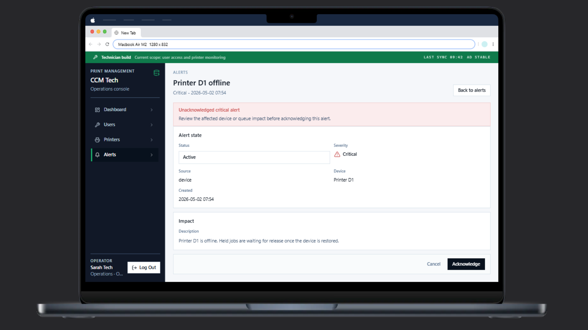
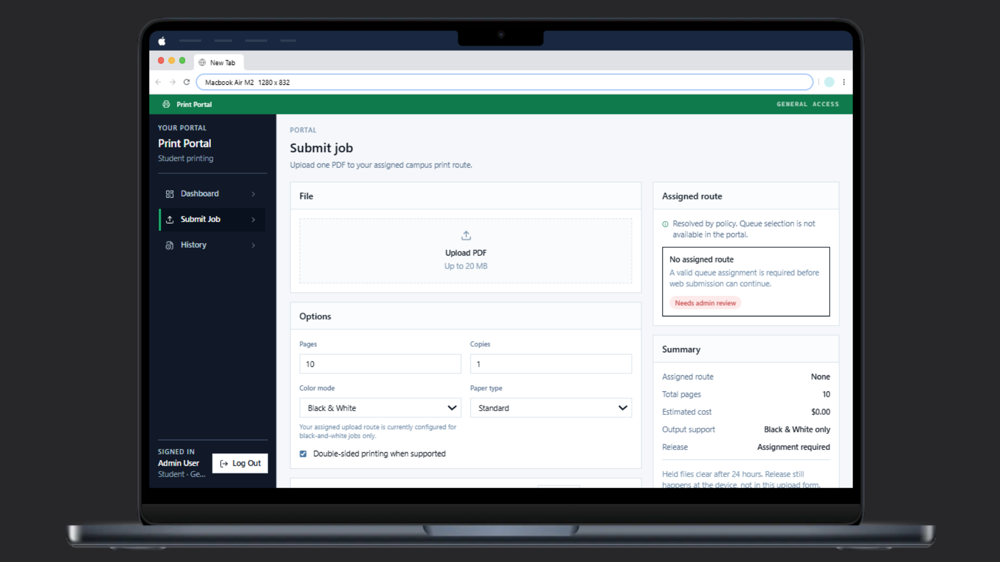

## Current State

Implemented at a high level:

- DB-backed sign-in using seeded development credentials and JWT sessions.
- Standard-user portal for dashboard, job submission, job history, and cancellation of pending jobs.
- Admin pages for dashboard, users, groups, printers, queues, logs, and management workflows.
- Technician pages for dashboard, users, printers, and alert handling.
- PostgreSQL schema and migrations for users, roles, quotas, printers, queues, queue assignments, jobs, job files, job events, logs, alerts, and seeded demo data.
- Diagnostic print delivery through raw socket printing and a Windows queue connector.

Still not implemented:

- Active Directory login and identity sync.
- Printer-panel secure release / real pull-print authentication.
- Reliable physical print completion telemetry from printers.
- Production cleanup for expired held jobs and stored files.

## Tech Stack

- Frontend: React, TypeScript, Vite, React Router, Tailwind CSS, Radix UI primitives.
- Backend: TypeScript, Express, `pg`, plain SQL migrations.
- Database: PostgreSQL.
- Print diagnostics: Ghostscript for PDF-to-PostScript conversion, raw TCP socket printing, and a Windows queue connector spike.

## Project Structure

```text
print-management-system/
├── frontend/          # React frontend application
├── backend/           # Express API, migrations, print connectors
├── docs/              # Project plan, database plan, architecture notes
├── AGENTS.md          # Current shared project memory
└── README.md
```

Important frontend locations:

- `frontend/src/app/` for routing and shell layouts.
- `frontend/src/features/` for admin, portal, and technician modules.
- `frontend/src/components/` for shared and page-specific UI components.
- `frontend/src/lib/api.ts` for the backend API client.

Important backend locations:

- `backend/src/server.ts` for the main API server.
- `backend/src/routes/` for `/api` and `/dev` routes.
- `backend/src/services/` for business logic.
- `backend/src/db/` for PostgreSQL pool and migration runner.
- `backend/migrations/` for SQL migrations.

## Local Setup

Prerequisites:

- Node.js 20+ for local development.
- npm 10+.
- Docker Desktop, or another local PostgreSQL instance.
- Ghostscript if testing raw socket PDF printing.

Install dependencies:

```bash
cd backend
npm install

cd ../frontend
npm install
```

Start PostgreSQL and apply migrations:

```bash
cd backend
docker compose up -d postgres
npm run db:migrate
```

Start the backend:

```bash
cd backend
npm run dev
```

Start the frontend:

```bash
cd frontend
npm run dev -- --host 127.0.0.1 --port 5173 --strictPort
```

Open:

```text
http://127.0.0.1:5173
```

Use `127.0.0.1` instead of `localhost` if another Vite app is running locally.

## Development Credentials

All seeded development users use password:

```text
123456
```

Seeded accounts:

- `admin@university.edu`
- `tech@university.edu`
- `student@university.edu`

This is temporary DB-backed development auth. The final target is Active Directory authentication with local PostgreSQL records still owning app roles, suspensions, quotas, technician privileges, and audit history.

## Main API Surface

The frontend uses backend routes under `/api`.

Key route groups:

- Auth: `/api/auth/*`
- Portal: `/api/portal/*`
- Jobs: `/api/jobs/*`
- Admin/technician management: `/api/users`, `/api/printers`, `/api/queues`, `/api/groups`, `/api/alerts`, `/api/logs`, `/api/dashboard`

Diagnostic print routes live under `/dev/*`. They are useful for hardware testing but should not be treated as the normal product flow.

## Print Delivery Notes

Normal product flow should go through the job lifecycle:

```text
portal/backend client -> POST /api/jobs -> held DB job -> release action -> connector boundary
```

Diagnostic paths currently available:

- `/dev/print-direct`: converts PDF to PostScript and sends bytes directly to the HP printer over TCP port `9100`.
- `/dev/print-windows-queue`: forwards a PDF to the Windows connector, which submits it to a Windows print queue.

These paths prove connector submission. They do not prove final physical completion, toner/paper state, jam state, or printer-panel authentication.

See `backend/README.md` for connector-specific setup and test commands.

## Validation Commands

Backend:

```bash
cd backend
npm run build
npm run typecheck
```

Frontend:

```bash
cd frontend
npm run build
npm run lint
```

Database migrations:

```bash
cd backend
npm run db:migrate
```

## Documentation

Use these documents for current project decisions:

- `AGENTS.md`: current shared project memory and constraints.
- `docs/project-todo.md`: execution plan and remaining work.
- `docs/backend-database-plan.md`: database requirements and design notes.
- `docs/architecture.md`: architecture boundaries and connector strategy.
- `docs/schema.sql`: reference SQL snapshot; backend migrations are the implementation source of truth.

## Team Members and Roles

- `Mohammed Ammar Sohail` - Frontend + Backend + embedded/device integration.
- `Moaz Ahmed` - SRS Documentation + Frontend Configuration + Bakcend & DB.
- `Ayman Musalli` - UI/UX design + Authentication.

## Notes

- Do not commit production credentials, VM credentials, printer passwords, or AD secrets.
- Keep uploaded and converted print files outside PostgreSQL. The database stores paths, hashes, metadata, expiry, and deletion timestamps.
- Direct raw socket printing and Windows queue submission are not the same as secure pull printing.
